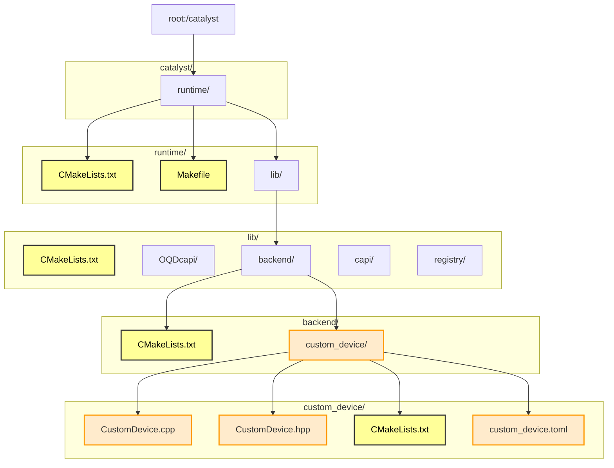

# How to add a custom device in Catalyst (Pennylane's JIT compiler)

```mermaid
graph TD

  A[root:/catalyst]

  subgraph catalyst/
    A1[runtime/]
  end

  subgraph runtime/
    R1[CMakeLists.txt]
    R2[Makefile]
    R3[lib/]
  end

  subgraph lib/
    L1[CMakeLists.txt]
    L2[OQDcapi/]
    L3[backend/]
    L4[capi/]
    L5[registry/]
  end

  subgraph backend/
    B1[CMakeLists.txt]
    B2[custom_device/]
  end

  subgraph custom_device/
    CD1[CustomDevice.cpp]
    CD2[CustomDevice.hpp]
    CD3[CMakeLists.txt]
    CD4[custom_device.toml]
  end

  %% Relationships
  A --> A1
  A1 --> R3
  A1 --> R1
  A1 --> R2
  R3 --> L3
  L3 --> B2
  L3 --> B1
  B2 --> CD1
  B2 --> CD2
  B2 --> CD3
  B2 --> CD4

  %% Styling
  classDef custom fill:#ffebcc,stroke:#ff9900,stroke-width:2px;
  classDef yellow fill:#ffff99,stroke:#333,stroke-width:2px,color:#000;

  class R1,R2,L1,B1,CD3 yellow;
  class B2,CD1,CD2,CD4 custom;

```
