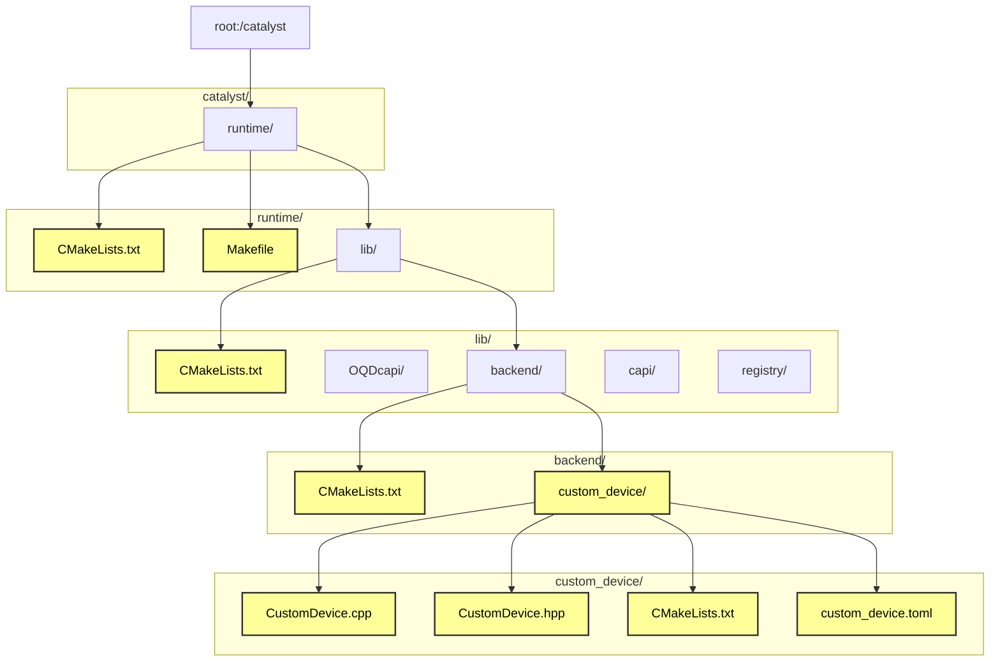

# How to add a custom device in Catalyst (Pennylane's JIT compiler)



Add files the files and folders colored in yellow, edit if they already exist. 

- CustomDevice.hpp: Header file for the custom device. Contains all the function signatures. 
- CustomDevice.cpp: Contains the implementations for all the functions.
- custom_device.toml: Configuration file for Pennylane to use the device, defines what gates and measurements are supported.
- CMakeLists.txt: To build the new device.

## Basic boilerplate code

#### CustomDevice.hpp
```
#pragma once
#include <QuantumDevice.hpp>
#include <vector>
#include <string>
#include <optional>

namespace Catalyst::Runtime::Devices {

struct CustomDevice final : public QuantumDevice {
    explicit CustomDevice(const std::string &kwargs);

    auto AllocateQubit() -> QubitIdType override;
    auto AllocateQubits(size_t num_qubits) -> std::vector<QubitIdType> override;
    void ReleaseQubit(QubitIdType) override;
    void ReleaseAllQubits() override;

    auto GetNumQubits() const -> size_t override;
    void SetDeviceShots(size_t shots) override;
    auto GetDeviceShots() const -> size_t override;

    void NamedOperation(const std::string &name,
                        const std::vector<double> &params,
                        const std::vector<QubitIdType> &wires,
                        bool inverse,
                        const std::vector<QubitIdType> &ctrl_wires,
                        const std::vector<bool> &ctrl_values) override;

    auto Measure(QubitIdType wire, std::optional<int32_t> postselect) -> Result override;

    void StartTapeRecording() override;
    void StopTapeRecording() override;

    void State(DataView<std::complex<double>, 1> &state) override;


};

} // namespace Catalyst::Runtime::Devices

```

#### CustomDevice.cpp
```
#include "CustomDevice.hpp"
#include <complex>
#include <vector>
#include <string>
#include <optional>
#include <iostream>

namespace Catalyst::Runtime::Devices {

CustomDevice::CustomDevice([[maybe_unused]] const std::string &kwargs) {
    std::cout << "Constructor: CustomDevice" << std::endl;
}

auto CustomDevice::AllocateQubit() -> QubitIdType {
    std::cout << "Called: AllocateQubit" << std::endl;
    return 0;
}

auto CustomDevice::AllocateQubits(size_t num_qubits) -> std::vector<QubitIdType> {
    std::cout << "Called: AllocateQubits" << std::endl;
    return std::vector<QubitIdType>(num_qubits, 0);
}

void CustomDevice::ReleaseQubit(QubitIdType) {
    std::cout << "Called: ReleaseQubit" << std::endl;
}

void CustomDevice::ReleaseAllQubits() {
    std::cout << "Called: ReleaseAllQubits" << std::endl;
}

auto CustomDevice::GetNumQubits() const -> size_t {
    std::cout << "Called: GetNumQubits" << std::endl;
    return 1; // Assume 1 qubit for simplicity
}

void CustomDevice::SetDeviceShots(size_t shots) {
    std::cout << "Called: SetDeviceShots with shots: " << shots << std::endl;
}

auto CustomDevice::GetDeviceShots() const -> size_t {
    std::cout << "Called: GetDeviceShots" << std::endl;
    return 1;
}

void CustomDevice::NamedOperation(const std::string &name,
                                 const std::vector<double> &params,
                                 const std::vector<QubitIdType> &wires,
                                 bool inverse,
                                 const std::vector<QubitIdType> &ctrl_wires,
                                 const std::vector<bool> &ctrl_values) {
    std::cout << "Called: NamedOperation with name: " << name << ", wires: ";
    for (const auto &wire : wires) {
        std::cout << wire << " ";
    }
    std::cout << ", inverse: " << inverse << std::endl;

    if (name == "Hadamard" && wires.size() == 1 && params.empty() && ctrl_wires.empty()) {
        std::cout << "Applying Hadamard gate on wire " << wires[0] << std::endl;
        // Simulate Hadamard application (e.g., update a state vector)
        // For demo, just log; in a real backend, apply the gate
    } else {
        std::cerr << "Unsupported operation: " << name << std::endl;
        throw std::runtime_error("Unsupported operation: " + name);
    }
}

auto CustomDevice::Measure(QubitIdType wire, std::optional<int32_t> postselect) -> Result {
    std::cout << "Called: Measure on wire " << wire << std::endl;
    bool *result = new bool(true); // Dummy result for |0>
    return result;
}

void CustomDevice::StartTapeRecording() {
    std::cout << "Called: StartTapeRecording" << std::endl;
}

void CustomDevice::StopTapeRecording() {
    std::cout << "Called: StopTapeRecording" << std::endl;
}

void CustomDevice::State(DataView<std::complex<double>, 1> &state) {
    std::cout << "Called: State" << std::endl;
}

} // namespace Catalyst::Runtime::Devices

GENERATE_DEVICE_FACTORY(CustomDevice, Catalyst::Runtime::Devices::CustomDevice)
```
#### custom_device.toml

```
schema = 3

[operators.gates]
Hadamard = { properties = ["invertible"] }  # Support Hadamard

[operators.observables]
PauliX = { }
PauliY = { }
PauliZ = { }
Hamiltonian = { conditions = ["terms-commute"] }
Sum = { conditions = ["terms-commute"] }
SProd = { }
Prod = { }

[measurement_processes]
ExpectationMP = { }
SampleMP = { }
CountsMP = { conditions = ["finiteshots"] }
StateMP = { conditions = ["analytic"] }

[compilation]
qjit_compatible = false
runtime_code_generation = false
dynamic_qubit_management = false
overlapping_observables = true
non_commuting_observables = false
initial_state_prep = false
supported_mcm_methods = []
```

## How to build?

#### /catalyst/runtime/lib/backend/custom_device/CMakeLists.txt
```
cmake_minimum_required(VERSION 3.20)

project(rtd_custom_device LANGUAGES CXX)

set(CMAKE_CXX_STANDARD 20)
set(CMAKE_CXX_STANDARD_REQUIRED ON)

add_library(rtd_custom_device SHARED CustomDevice.cpp)

target_include_directories(rtd_custom_device
    PUBLIC
    ${CMAKE_CURRENT_SOURCE_DIR}
    PRIVATE
    ${runtime_includes}
    ${backend_utils_includes}
)

set_property(TARGET rtd_custom_device PROPERTY POSITION_INDEPENDENT_CODE ON)
```

#### /catalyst/runtime/lib/backend/CMakeLists.txt


<pre><code>```diff add_subdirectory(null_qubit) configure_file(null_qubit/null_qubit.toml null_qubit.toml) +add_subdirectory(custom_device) +configure_file(custom_device/custom_device.toml custom_device.toml) if(ENABLE_OQD) add_subdirectory(oqd) configure_file(oqd/oqd.toml oqd.toml) endif() if(ENABLE_OPENQASM) add_subdirectory(openqasm) configure_file(openqasm/braket_local_qubit.toml braket_local_qubit.toml) configure_file(openqasm/braket_aws_qubit.toml braket_aws_qubit.toml) endif() ```</code></pre>
