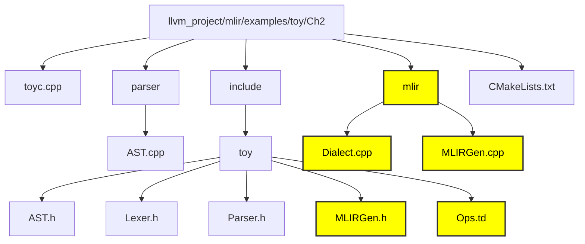

```mermaid
graph TD
  ch2_compiler["llvm_project/mlir/examples/toy/Ch2"]

  toyc.cpp["toyc.cpp"]
  include["include"]
  parser["parser"]
  mlir["mlir"] 
  cmakelists.txt["CMakeLists.txt"]

  ch2_compiler --> toyc.cpp
  ch2_compiler --> include
  ch2_compiler --> parser
  ch2_compiler --> mlir
  ch2_compiler --> cmakelists.txt

  AST.cpp["AST.cpp"]

  parser --> AST.cpp

  toy["toy"]

  include --> toy

  AST.h["AST.h"]
  Lexer.h["Lexer.h"]
  Parser.h["Parser.h"]
  MLIRGen.h["MLIRGen.h"]
  Ops.td["Ops.td"]

  toy --> AST.h
  toy --> Lexer.h
  toy --> Parser.h
  toy --> MLIRGen.h
  toy --> Ops.td

  Dialect.cpp["Dialect.cpp"] 
  MLIRGen.cpp["MLIRGen.cpp"] 

  mlir --> Dialect.cpp
  mlir --> MLIRGen.cpp

  classDef yellow fill:#ff0,stroke:#333,stroke-width:2px,color:#000;

  class mlir yellow
  class Dialect.cpp yellow
  class MLIRGen.cpp yellow
  class MLIRGen.h yellow
  class Ops.td yellow
```
