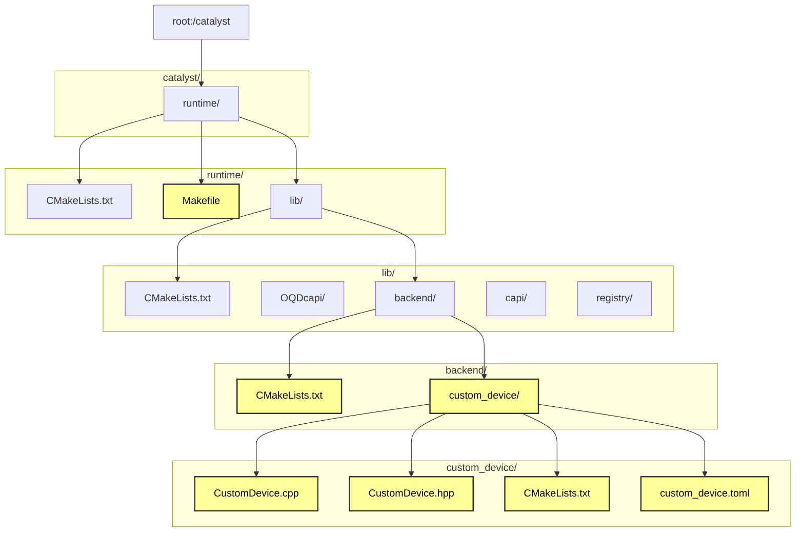

# How to add a custom device in Catalyst (Pennylane's JIT compiler)



Add files the files and folders colored in yellow, edit if they already exist. 

- CustomDevice.hpp: Header file for the custom device. Contains all the function signatures. 
- CustomDevice.cpp: Contains the implementations for all the functions.
- custom_device.toml: Configuration file for Pennylane to use the device, defines what gates and measurements are supported.
- CMakeLists.txt: To build the new device.

## Basic boilerplate code

#### CustomDevice.hpp
```
#pragma once

#include <algorithm>
#include <complex>
#include <memory>
#include <optional>
#include <random>
#include <vector>
#include <string>

#include "DataView.hpp"
#include "QuantumDevice.hpp"
#include "QubitManager.hpp"
#include "Types.h"

namespace Catalyst::Runtime::Devices {

struct CustomDevice : public QuantumDevice {
    explicit CustomDevice(const std::string &kwargs);
    ~CustomDevice() override;

    auto AllocateQubit() -> QubitIdType override;
    auto AllocateQubits(size_t num_qubits) -> std::vector<QubitIdType> override;
    void ReleaseQubit(QubitIdType) override;
    void ReleaseAllQubits() override;

    auto GetNumQubits() const -> size_t override;
    void SetDeviceShots(size_t shots) override;
    auto GetDeviceShots() const -> size_t override;

    void NamedOperation(const std::string &name,
                        const std::vector<double> &params,
                        const std::vector<QubitIdType> &wires,
                        bool inverse,
                        const std::vector<QubitIdType> &ctrl_wires,
                        const std::vector<bool> &ctrl_values) override;

    auto Measure(QubitIdType wire, std::optional<int32_t> postselect) -> Result override;

    void StartTapeRecording() override;
    void StopTapeRecording() override;

    void State(DataView<std::complex<double>, 1> &state) override;

private:
    void applyHadamard(QubitIdType wire);
    void getState(DataView<std::complex<double>, 1> &state);

    size_t num_qubits_{0};
    std::vector<std::complex<double>> state_;
};

} // namespace Catalyst::Runtime::Devices
```

#### CustomDevice.cpp
```
#include "CustomDevice.hpp"
#include <complex>
#include <vector>
#include <string>
#include <optional>
#include <iostream>
#include <cmath>
#include <stdexcept>

using std::vector;
using std::string;
using std::optional;
using std::complex;
using std::cout;
using std::cerr;
using std::runtime_error;

// Helper function to print the state vector
void printState(const vector<complex<double>>& state, const string& label) {
    cout << label << ": [";
    for (size_t i = 0; i < state.size(); ++i) {
        cout << state[i].real() << "+" << state[i].imag() << "j";
        if (i < state.size() - 1) cout << ", ";
    }
    cout << "]\n";
}

namespace Catalyst::Runtime::Devices {

CustomDevice::CustomDevice([[maybe_unused]] const string &kwargs) {
    cout << "Constructor: CustomDevice\n";
    cout << "kwargs: " << kwargs << '\n';
    printState(state_, "State after constructor");
}

CustomDevice::~CustomDevice() = default;

void CustomDevice::applyHadamard(QubitIdType wire) {
    size_t dim = 1ULL << num_qubits_;
    vector<complex<double>> new_state(dim, 0.0);
    double sqrt2_inv = 1.0 / sqrt(2.0);

    for (size_t i = 0; i < dim; ++i) {
        size_t idx0 = i;
        size_t idx1 = i ^ (1ULL << wire);
        if (idx0 < idx1) {
            new_state[idx0] = sqrt2_inv * (state_[idx0] + state_[idx1]);
            new_state[idx1] = sqrt2_inv * (state_[idx0] - state_[idx1]);
        }
    }

    state_ = std::move(new_state);
    printState(state_, "State after Hadamard on wire " + std::to_string(wire));
}

void CustomDevice::getState(DataView<complex<double>, 1> &state) {
    if (state.size() != state_.size()) {
        throw runtime_error("State vector size mismatch");
    }
    copy(state_.begin(), state_.end(), state.begin());
}

auto CustomDevice::AllocateQubit() -> QubitIdType {
    cout << "Called: AllocateQubit\n";
    size_t new_num_qubits = num_qubits_ + 1;
    size_t dim = 1ULL << new_num_qubits;
    state_.resize(dim, 0.0);
    state_[0] = 1.0; // Initialize to |0...0>
    num_qubits_ = new_num_qubits;
    printState(state_, "State after AllocateQubit");
    return static_cast<QubitIdType>(new_num_qubits - 1);
}

auto CustomDevice::AllocateQubits(size_t num_qubits) -> vector<QubitIdType> {
    cout << "Called: AllocateQubits\n";
    if (num_qubits == 0) {
        return {};
    }
    size_t current_num_qubits = num_qubits_;
    size_t new_num_qubits = current_num_qubits + num_qubits;
    size_t dim = 1ULL << new_num_qubits;
    state_.resize(dim, 0.0);
    state_[0] = 1.0; // Initialize to |0...0>
    num_qubits_ = new_num_qubits;
    printState(state_, "State after AllocateQubits");

    vector<QubitIdType> qubits(num_qubits);
    for (size_t i = 0; i < num_qubits; ++i) {
        qubits[i] = static_cast<QubitIdType>(current_num_qubits + i);
    }
    return qubits;
}

void CustomDevice::ReleaseQubit(QubitIdType) {
    cout << "Called: ReleaseQubit\n";
    if (num_qubits_ > 0) {
        size_t new_num_qubits = num_qubits_ - 1;
        size_t dim = 1ULL << new_num_qubits;
        state_.resize(dim, 0.0);
        state_[0] = 1.0; // Initialize to |0...0>
        num_qubits_ = new_num_qubits;
        printState(state_, "State after ReleaseQubit");
    }
}

void CustomDevice::ReleaseAllQubits() {
    cout << "Called: ReleaseAllQubits\n";
    num_qubits_ = 0;
    state_.clear();
    printState(state_, "State after ReleaseAllQubits");
}

auto CustomDevice::GetNumQubits() const -> size_t {
    cout << "Called: GetNumQubits\n";
    return num_qubits_;
}

void CustomDevice::SetDeviceShots(size_t shots) {
    cout << "Called: SetDeviceShots with shots: " << shots << '\n';
    // Shots not used in state vector simulation
}

auto CustomDevice::GetDeviceShots() const -> size_t {
    cout << "Called: GetDeviceShots\n";
    return 0; // State vector simulation doesn't use shots
}

void CustomDevice::NamedOperation(const string &name,
                                 const vector<double> &params,
                                 const vector<QubitIdType> &wires,
                                 bool inverse,
                                 const vector<QubitIdType> &ctrl_wires,
                                 const vector<bool> &ctrl_values) {
    if (name == "Hadamard" && wires.size() == 1 && params.empty() && ctrl_wires.empty() && !inverse) {
        cout << "Applying Hadamard gate on wire " << wires[0] << '\n';
        applyHadamard(wires[0]);
    } else {
        cerr << "Unsupported operation: " << name << '\n';
        throw runtime_error("Unsupported operation: " + name);
    }
}

auto CustomDevice::Measure(QubitIdType wire, optional<int32_t> postselect) -> Result {
    cout << "Called: Measure on wire " << wire << '\n';
    bool *result = new bool(true); // Dummy result for |0>
    return result;
}

void CustomDevice::StartTapeRecording() {
    cout << "Called: StartTapeRecording\n";
}

void CustomDevice::StopTapeRecording() {
    cout << "Called: StopTapeRecording\n";
}

void CustomDevice::State(DataView<complex<double>, 1> &state) {
    cout << "Called: State\n";
    getState(state);
}

} // namespace Catalyst::Runtime::Devices

GENERATE_DEVICE_FACTORY(CustomDevice, Catalyst::Runtime::Devices::CustomDevice)
```
#### custom_device.toml

```
schema = 3

[operators.gates]
Hadamard = { properties = ["invertible"] }  # Support Hadamard

[operators.observables]


[measurement_processes]
ExpectationMP = { }
SampleMP = { }
CountsMP = { conditions = ["finiteshots"] }
StateMP = { conditions = ["analytic"] }

[compilation]
qjit_compatible = false
runtime_code_generation = false
dynamic_qubit_management = false
overlapping_observables = true
non_commuting_observables = false
initial_state_prep = false
supported_mcm_methods = []
```

## How to build?

### Add/edit lines in green

#### /catalyst/runtime/lib/backend/custom_device/CMakeLists.txt
```
cmake_minimum_required(VERSION 3.20)

project(rtd_custom_device LANGUAGES CXX)

set(CMAKE_CXX_STANDARD 20)
set(CMAKE_CXX_STANDARD_REQUIRED ON)

add_library(rtd_custom_device SHARED CustomDevice.cpp)

target_include_directories(rtd_custom_device
    PUBLIC
    ${CMAKE_CURRENT_SOURCE_DIR}
    PRIVATE
    ${runtime_includes}
    ${backend_utils_includes}
)

set_property(TARGET rtd_custom_device PROPERTY POSITION_INDEPENDENT_CODE ON)
```

#### /catalyst/runtime/lib/backend/CMakeLists.txt

```diff
 add_subdirectory(null_qubit)
 configure_file(null_qubit/null_qubit.toml null_qubit.toml)

+add_subdirectory(custom_device)
+configure_file(custom_device/custom_device.toml custom_device.toml)

 if(ENABLE_OQD)
 add_subdirectory(oqd)
 configure_file(oqd/oqd.toml oqd.toml)
 endif()

 if(ENABLE_OPENQASM)
 add_subdirectory(openqasm)
 configure_file(openqasm/braket_local_qubit.toml braket_local_qubit.toml)
 configure_file(openqasm/braket_aws_qubit.toml braket_aws_qubit.toml)
 endif()
```

#### /catalyst/runtime/Makefile

```diff
PYTHON ?= $(shell which python3)
PYTHON_PREFIX := $(shell $(PYTHON) -c "import sys; print(sys.prefix)")
PYTHON_VERSION := $(shell $(PYTHON) -c "import sys; print(f'{sys.version_info.major}.{sys.version_info.minor}')")
C_COMPILER ?= $(shell which clang)
CXX_COMPILER ?= $(shell which clang++)
COMPILER_LAUNCHER ?= $(shell which ccache)
NPROC ?= $(shell python3 -c "import os; print(os.cpu_count())")

MK_ABSPATH := $(abspath $(lastword $(MAKEFILE_LIST)))
MK_DIR := $(dir $(MK_ABSPATH))
RT_BUILD_DIR ?= $(MK_DIR)/build
CODE_COVERAGE ?= OFF
BUILD_TYPE ?= RelWithDebInfo
ENABLE_OPENQASM ?= ON
ENABLE_OQD ?= OFF
ENABLE_ASAN ?= OFF
STRICT_WARNINGS ?= ON
LLVM_DIR ?= $(MK_DIR)/../mlir/llvm-project/

PLATFORM := $(shell uname -s)

# Since we build executables for all test targets in this file, there is no reason to preload.
# Preloading while the ASAN RT is already embedded in the executable can lead to the "incompatible
# ASAN runtimes detected" error, at least on Linux (macOS seemed okay with it).
# If necessary, add ASAN flags here to fine-tune behaviour (e.g. ASAN_OPTIONS="...").
ASAN_COMMAND :=

# Note: ASAN replaces dlopen calls, which means that when we open other libraries via dlopen that
#       relied on the parent's library's RPATH, these libraries are no longer found.
#         e.g. `dlopen(openqasm_python_module.so)` from OpenQASMRunner.hpp
#       We can fix this using LD_LIBRARY_PATH (for dev builds).
ifeq ($(PLATFORM), Linux)
ASAN_FLAGS = LD_LIBRARY_PATH="$(RT_BUILD_DIR)/lib:$(LD_LIBRARY_PATH)"
# Python tests can generally produce leaks, here observed on Linux. OpenQASM tests call into Python.
PY_ASAN_OPTIONS := ASAN_OPTIONS="detect_leaks=0"
endif

# Deferred assignment since RT_BUILD_DIR can be modified by the targets.
ifeq ($(ENABLE_ASAN), ON)
ASAN_COMMAND = $(ASAN_FLAGS)
endif

+BUILD_TARGETS := rt_capi rtd_null_qubit rtd_custom_device
TEST_TARGETS := runner_tests_qir_runtime runner_tests_mbqc_runtime

ifeq ($(ENABLE_OPENQASM), ON)
	BUILD_TARGETS += rtd_openqasm
	TEST_TARGETS += runner_tests_openqasm
endif

ifeq ($(ENABLE_OQD), ON)
	BUILD_TARGETS += rt_OQD_capi rtd_oqd_device
	TEST_TARGETS += runner_tests_oqd
endif

.PHONY: help
help:
	@echo "Please use \`make <target>' where <target> is one of"
	@echo "  all                to build Catalyst Runtime"
	@echo "  coverage           to generate a coverage report using lcov"
	@echo "  clean              to delete all temporary, cache, and build files"
	@echo "  test               to run the Catalyst runtime test suite"
	@echo "  format [check=1]   to apply C++ formatter; use with 'check=1' to check instead of modify (requires clang-format)"
	@echo "  format [version=?] to apply C++ formatter; use with 'version={version}' to run clang-format-{version} instead of clang-format"
	@echo "  check-tidy         to build Catalyst Runtime with RUNTIME_CLANG_TIDY=ON (requires clang-tidy)"

.PHONY: configure
configure:
	@echo "Configure Catalyst Runtime"

	cmake -G Ninja -B $(RT_BUILD_DIR) . \
		-DCMAKE_BUILD_TYPE=$(BUILD_TYPE) \
		-DCMAKE_LIBRARY_OUTPUT_DIRECTORY=$(RT_BUILD_DIR)/lib \
		-DCMAKE_C_COMPILER=$(C_COMPILER) \
		-DMLIR_INCLUDE_DIRS=$(LLVM_DIR)/mlir/include \
		-DCMAKE_CXX_COMPILER=$(CXX_COMPILER) \
		-DCMAKE_C_COMPILER_LAUNCHER=$(COMPILER_LAUNCHER) \
		-DCMAKE_CXX_COMPILER_LAUNCHER=$(COMPILER_LAUNCHER) \
		-DENABLE_OPENQASM=$(ENABLE_OPENQASM) \
		-DENABLE_OQD=$(ENABLE_OQD) \
		-DENABLE_CODE_COVERAGE=$(CODE_COVERAGE) \
		-DPython_EXECUTABLE=$(PYTHON) \
		-DENABLE_ADDRESS_SANITIZER=$(ENABLE_ASAN) \
		-DRUNTIME_ENABLE_WARNINGS=$(STRICT_WARNINGS)

.PHONY: runtime
runtime: configure
	cmake --build $(RT_BUILD_DIR) --target $(BUILD_TARGETS) -j$(NPROC)

.PHONY: test_runner
test_runner: configure
	cmake --build $(RT_BUILD_DIR) --target $(TEST_TARGETS) -j$(NPROC)

.PHONY: test
test: CODE_COVERAGE=OFF
test: BUILD_TYPE?=RelWithDebInfo
test: test_runner
	@echo "Catalyst runtime test suite - NullQubit"
	$(ASAN_COMMAND) $(RT_BUILD_DIR)/tests/runner_tests_qir_runtime
	@echo "Catalyst MBQC runtime test suite"
	$(ASAN_COMMAND) $(RT_BUILD_DIR)/tests/runner_tests_mbqc_runtime
ifeq ($(ENABLE_OPENQASM), ON)
	# Test the OpenQasm devices C++ tests
	$(ASAN_COMMAND) $(PY_ASAN_OPTIONS) $(RT_BUILD_DIR)/tests/runner_tests_openqasm
endif
ifeq ($(ENABLE_OQD), ON)
	# Test the OQD devices C++ tests
	$(ASAN_COMMAND) $(RT_BUILD_DIR)/tests/runner_tests_oqd
endif

.PHONY: coverage
coverage: RT_BUILD_DIR := $(RT_BUILD_DIR)_cov
coverage: CODE_COVERAGE=ON
coverage: BUILD_TYPE=Debug
coverage: C_COMPILER=$(shell which gcc)
coverage: CXX_COMPILER=$(shell which g++)
coverage: export LLVM_PROFILE_FILE := $(RT_BUILD_DIR)/tests/%m.profraw
coverage: test_runner
	@echo "check C++ code coverage"
	$(ASAN_COMMAND) $(RT_BUILD_DIR)/tests/runner_tests_qir_runtime
	$(ASAN_COMMAND) $(RT_BUILD_DIR)/tests/runner_tests_mbqc_runtime
ifeq ($(ENABLE_OPENQASM), ON)
	$(ASAN_COMMAND) $(PY_ASAN_OPTIONS) $(RT_BUILD_DIR)/tests/runner_tests_openqasm
endif
ifeq ($(ENABLE_OQD), ON)
	$(ASAN_COMMAND) $(RT_BUILD_DIR)/tests/runner_tests_oqd
endif
ifeq ($(PLATFORM),Linux)
	lcov --directory $(RT_BUILD_DIR) -b $(MK_DIR)/lib --capture --output-file $(RT_BUILD_DIR)/coverage.info
	lcov --remove $(RT_BUILD_DIR)/coverage.info '/usr/*' '*/_deps/*' '*/envs/*' '*/mlir/*' --output-file $(RT_BUILD_DIR)/coverage.info -q
	genhtml $(RT_BUILD_DIR)/coverage.info --output-directory $(RT_BUILD_DIR)/cov -t "Catalyst Runtime C++ Coverage" --num-spaces 4  -q
else
	xcrun llvm-profdata merge $(RT_BUILD_DIR)/tests/*.profraw -o $(RT_BUILD_DIR)/tests/rt_test_coverage.profdata
	xcrun llvm-cov show -instr-profile $(RT_BUILD_DIR)/tests/rt_test_coverage.profdata \
		-object $(RT_BUILD_DIR)/tests/runner_tests_openqasm \
		$(RT_BUILD_DIR)/tests/runner_tests_qir_runtime \
		$(RT_BUILD_DIR)/tests/runner_tests_mbqc_runtime \
		-format=html -output-dir=$(RT_BUILD_DIR)/coverage_html \
		$(MK_DIR)/include $(MK_DIR)/lib $(MK_DIR)/tests
endif

.PHONY: clean
clean:
	@echo "clean build files"
	rm -rf $(RT_BUILD_DIR) $(RT_BUILD_DIR)_cov cov coverage.info $(MK_DIR)/BuildTidy

.PHONY: format
format:
ifdef check
	$(PYTHON) ../bin/format.py --check $(if $(version:-=),--cfversion $(version)) .
else
	$(PYTHON) ../bin/format.py $(if $(version:-=),--cfversion $(version)) .
endif

.PHONY: check-tidy
check-tidy:
	@echo "build Catalyst Runtime with RUNTIME_CLANG_TIDY=ON"
	cmake -G Ninja -B $(MK_DIR)/BuildTidy . \
		-DCMAKE_BUILD_TYPE=$(BUILD_TYPE) \
		-DCMAKE_C_COMPILER=$(C_COMPILER) \
		-DCMAKE_CXX_COMPILER=$(CXX_COMPILER) \
		-DRUNTIME_CLANG_TIDY=ON

	cmake --build $(MK_DIR)/BuildTidy --target rt_capi -j$(NPROC)

```

## How to use this new device with Pennylane?

#### Boilerplate code for the circuit (circuit.py)

```
import pennylane as qml
from pennylane import numpy as np
from pennylane import qjit
import pathlib

class CustomDevice(qml.devices.Device):
    config_filepath = pathlib.Path("/catalyst/runtime/lib/backend/custom_device/custom_device.toml")

    @staticmethod
    def get_c_interface():
        return "CustomDevice", "/catalyst/runtime/build/lib/librtd_custom_device.so"

    def __init__(self, shots=None, wires=None):
        super().__init__(wires=wires, shots=shots)

    @property
    def operations(self):
        return {"Hadamard"}  # Declare Hadamard as supported

    @property
    def observables(self):
        return {"State"}  # Support state measurement

    def execute(self, circuits, config):
        # Placeholder: Implement circuit execution
        # This should call the C++ backend to execute the circuit
        return np.array([1.0, 0.0], dtype=np.complex128)  # Dummy state for |0>

@qjit(keep_intermediate=True)
@qml.qnode(CustomDevice(wires=1))
def circuit():
    qml.Hadamard(wires=0)
    qml.Hadamard(wires=0)
    return qml.state()

print(circuit())
```


